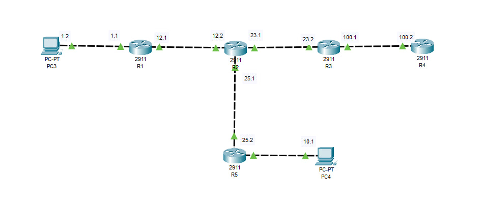

# OSPF-NSSA-RIP-Redistribution-Lab

Practical networking lab demonstrating **OSPF multi-area design, stub and NSSA areas, and route redistribution between RIP and OSPF**.

This lab simulates a small enterprise network where different routing protocols interact. The topology includes several routers connected through the OSPF backbone, an NSSA area, a stub area, and a RIP domain connected through route redistribution.

All configurations were implemented in **Cisco Packet Tracer**.

## Technologies

- Routing Protocols: OSPFv2, RIP v2
- Multi-area OSPF
- Stub area configuration
- NSSA area configuration
- Route redistribution (RIP → OSPF)
- Static default route
- IPv4 addressing

## Lab Topology

The topology includes:

- OSPF backbone area (Area 0)
- Stub area connected to a client LAN
- NSSA area connected to another routing domain
- RIP routing domain on the edge router
- Two client networks connected through different routing paths

## Implementation Highlights

- Configured **multi-area OSPF** with backbone Area 0
- Implemented a **stub area (Area 1)** to reduce routing information
- Configured **NSSA (Area 51)** for external route injection
- Enabled **RIP v2** on the edge router
- Implemented **route redistribution from RIP into OSPF**
- Added a **static default route** on the RIP router
- Verified connectivity between all networks

## Verification

- Verified interface status and routing tables using Cisco IOS commands
- Confirmed OSPF neighbor relationships and LSDB entries
- Observed **Type 7 LSA generation in the NSSA area**
- Verified successful **RIP to OSPF route redistribution**
- End-to-end connectivity confirmed between:
  - PC3 and PC4
  - PC3 and R4 loopback network
  - all intermediate routers
